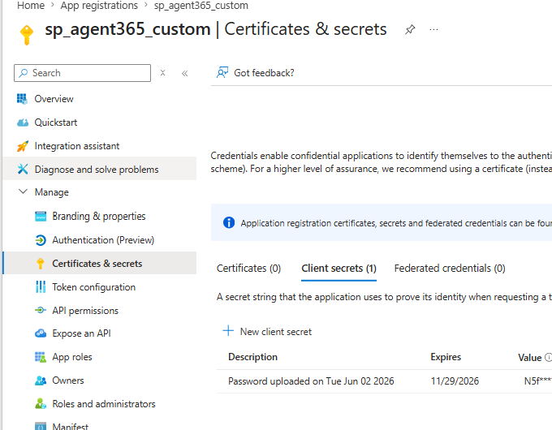
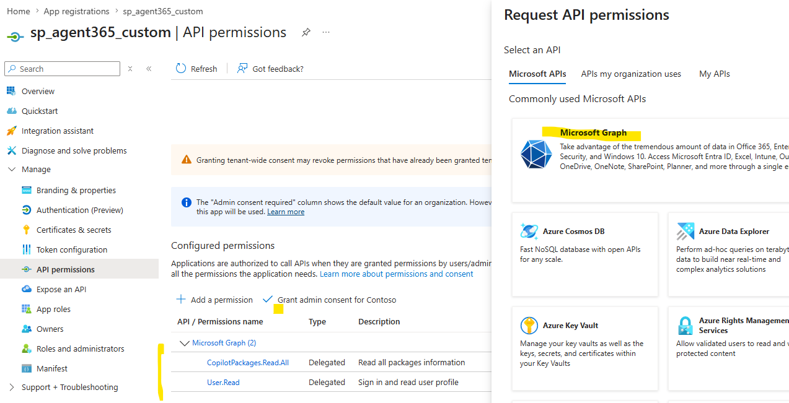
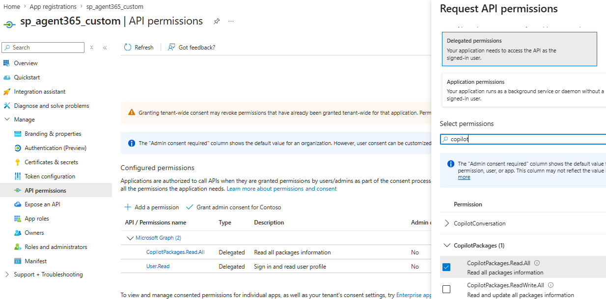
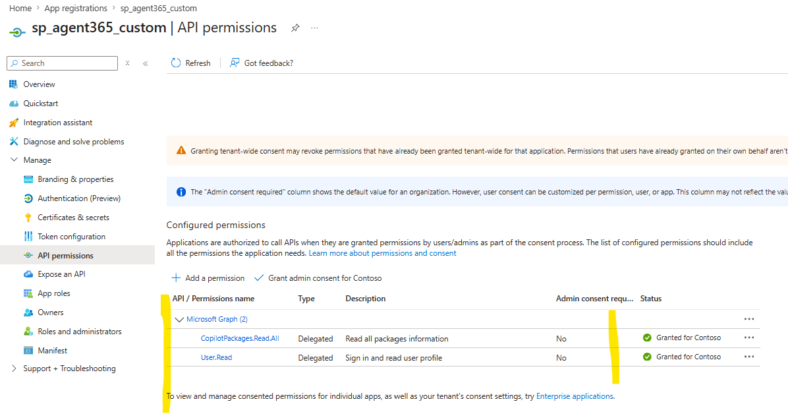
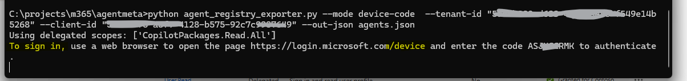
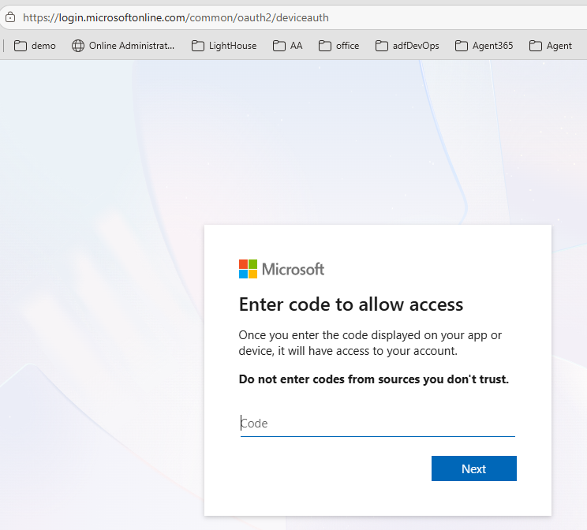
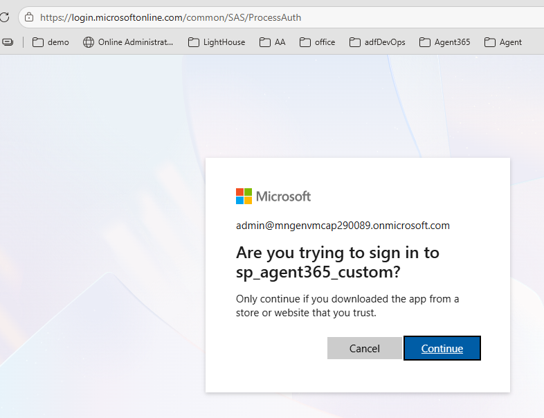
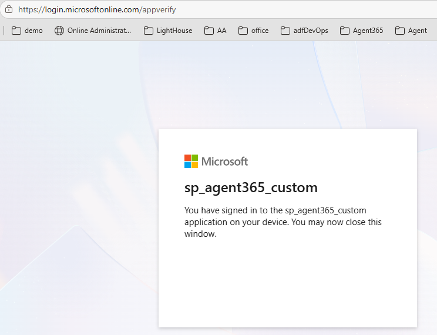

# Agent Registry Exporter

## ⚠️ DISCLAIMER

**This repository contains test/playground code only. It has not been validated in a customer production environment. Use only in a non-customer-impact environment and perform your own due diligence. There is no warranty, and this code is not legally binding.**

---

Small CLI tool to extract metadata for agents registered in the Microsoft 365 admin center using Microsoft Graph beta endpoint:
API reference: https://learn.microsoft.com/en-us/microsoft-365/copilot/extensibility/api/admin-settings/package/overview  


GET https://graph.microsoft.com/beta/copilot/admin/catalog/packages

Features
- App-only (client credentials) auth via MSAL
- Delegated device-code auth via MSAL
- Pagination handling, JSON and optional CSV export

Permissions
You must grant the calling identity appropriate Graph permissions. See Microsoft docs:
https://learn.microsoft.com/en-us/microsoft-365/admin/manage/agent-registry?view=o365-worldwide

For delegated access, grant the appropriate delegated permission and sign in interactively. The default delegated scope is:
- CopilotPackages.Read.All (delegated)

For app-only automation, add the application permission:
- CopilotPackages.Read.All (application) — grant admin consent

### Setting up Client Credentials (App-Only)

#### Step 1: Create Application Secret


#### Step 2: Grant Access Permissions




## Usage
1. Install dependencies:
```
pip install -r requirements.txt
```

2. Delegated example (device code; default):

Before running device-code auth, ensure your app registration is configured for a public client:
- Authentication > Allow public client flows = Yes


Microsoft Graph (2) 
CopilotPackages.Read.All  |  Delegated | Read all packages information| No | Granted for Contoso
User.Read | Delegated | Sign in and read user profile  |  No |  Granted for Contoso

Then run:
```
e.g.
C:\projects\m365\agentmeta>python agent_registry_exporter.py --mode device-code  --tenant-id "<tenantid>" --client-id "<clientid>" --out-json agents.json

```

#### Running the Script


#### Device Code Sign-In Flow




3. App-only example (client credentials):
```
python agent_registry_exporter.py --mode client-credentials \
  --tenant-id <TENANT_ID> --client-id <APP_ID> --client-secret <CLIENT_SECRET> \
  --out-json agents.json --out-csv agents.csv
```

Notes
- The script calls the Graph beta endpoint. Beta APIs are subject to change and not for production-critical workloads.
- Ensure your app registration has the correct permissions and that admin consent is granted when using application permissions.

Files
- `agent_registry_exporter.py`: main script
- `requirements.txt`: Python dependencies
- `.env.example`: example env variables for local testing
